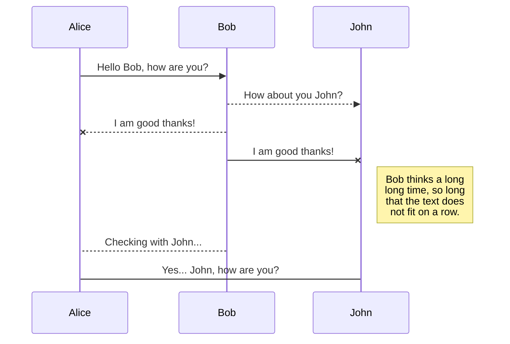
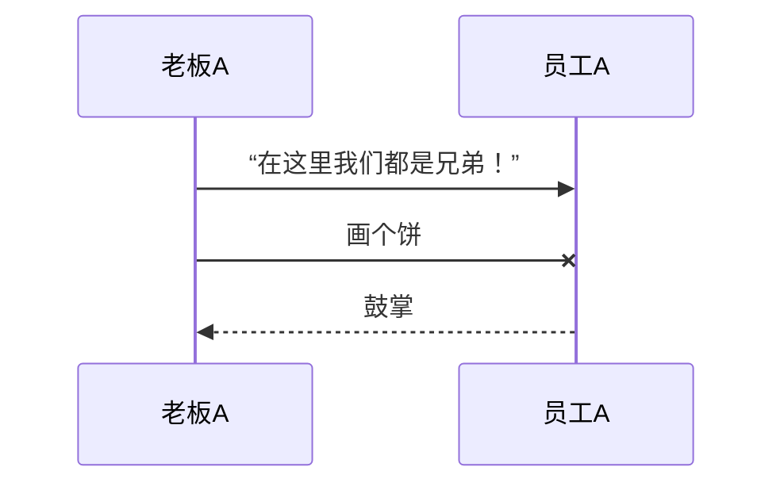
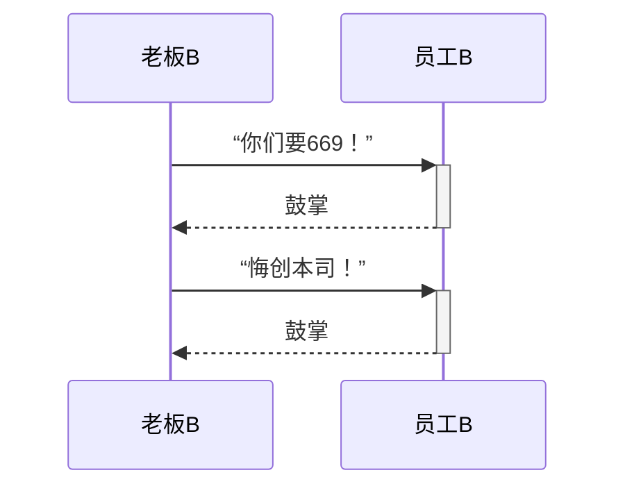
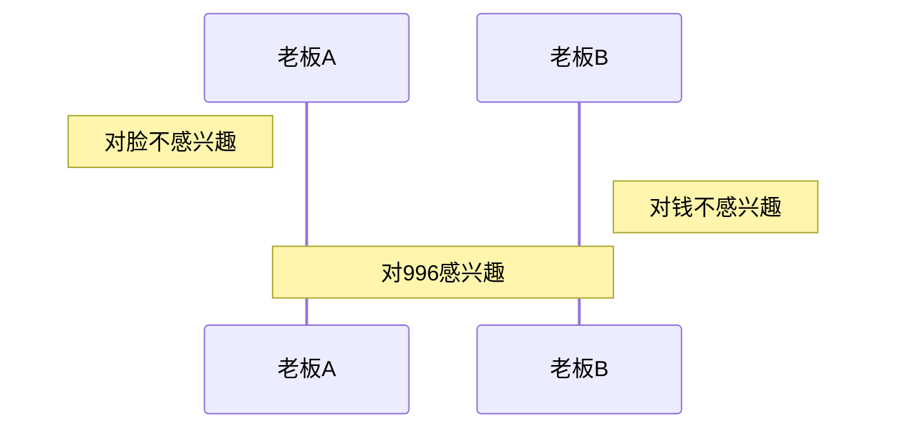
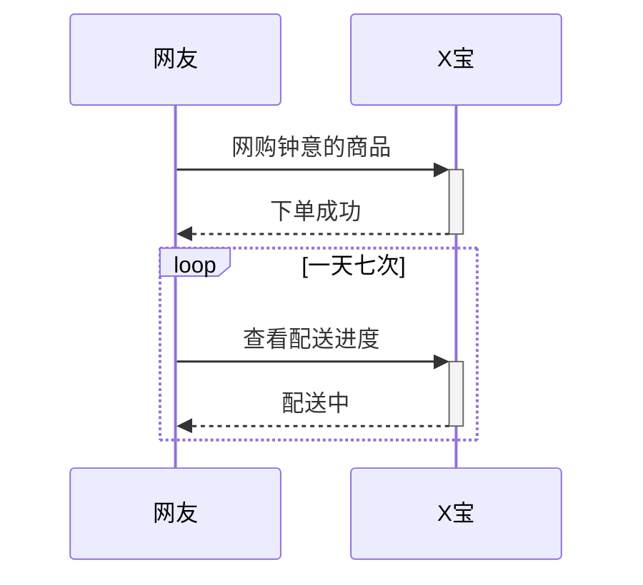
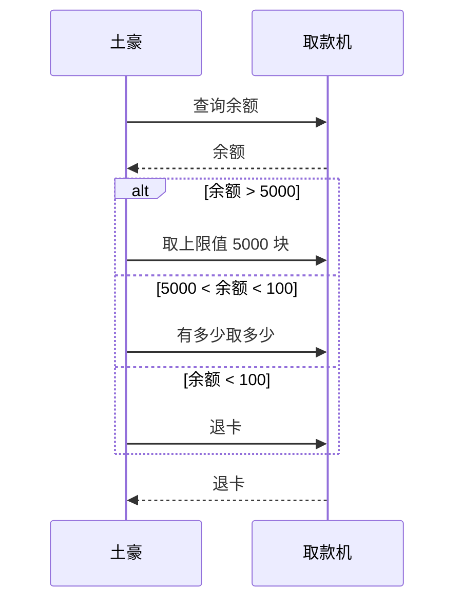
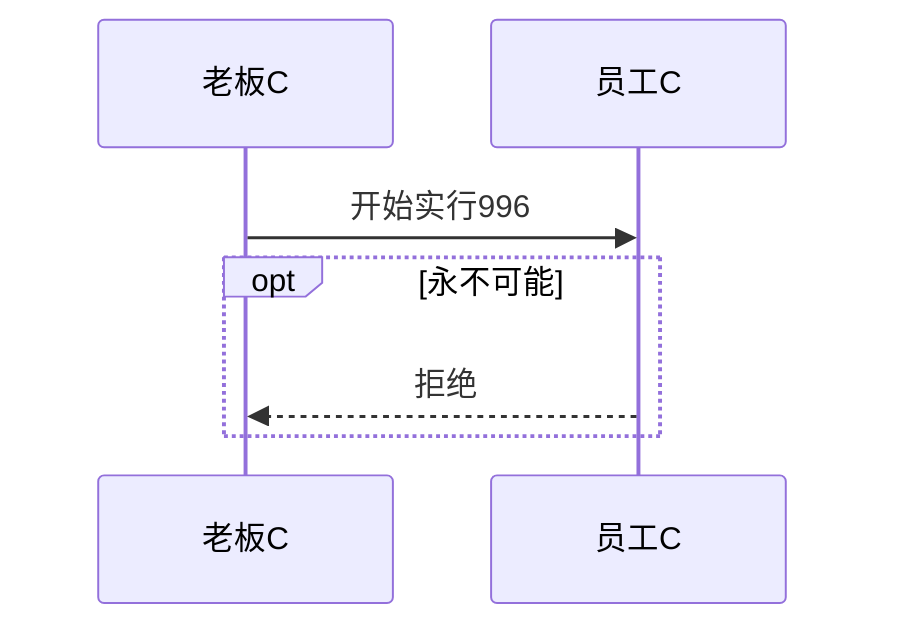
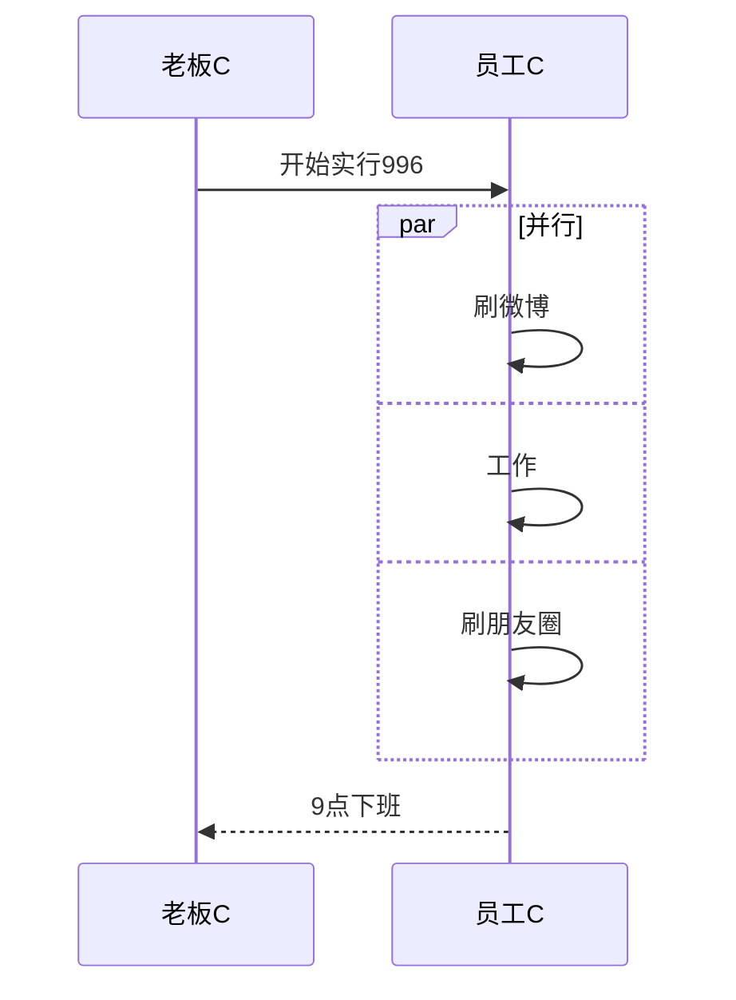

# 语法

https://zhuanlan.zhihu.com/p/70261692



##  消息


```
消息语句格式为：`<参与者> <箭头> <参与者> : <描述文本>`。  
其中 `<箭头>`的写法有：  
`->>` 显示为实线箭头（主动发出消息）  
`-->>`显示为虚线箭头（响应）  
`-x`显示为末尾带「X」的实线箭头（异步消息）
```

## 激活框



## **注解**



### **循环（loop）**



### **选择（alt）**



### **可选（opt）**



### **并行（Par）**

